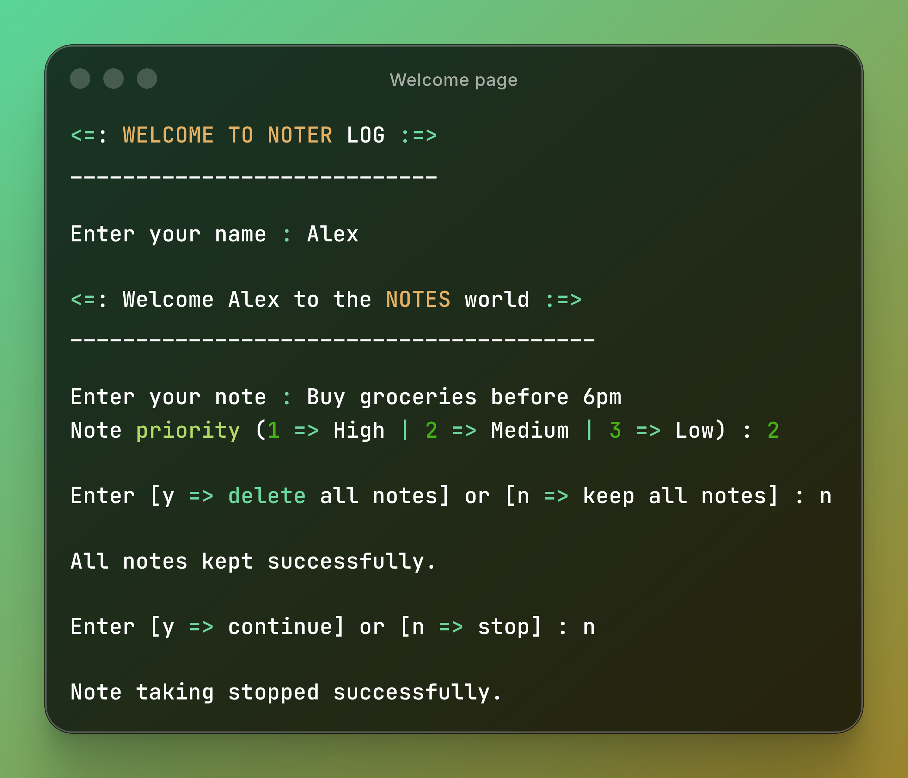
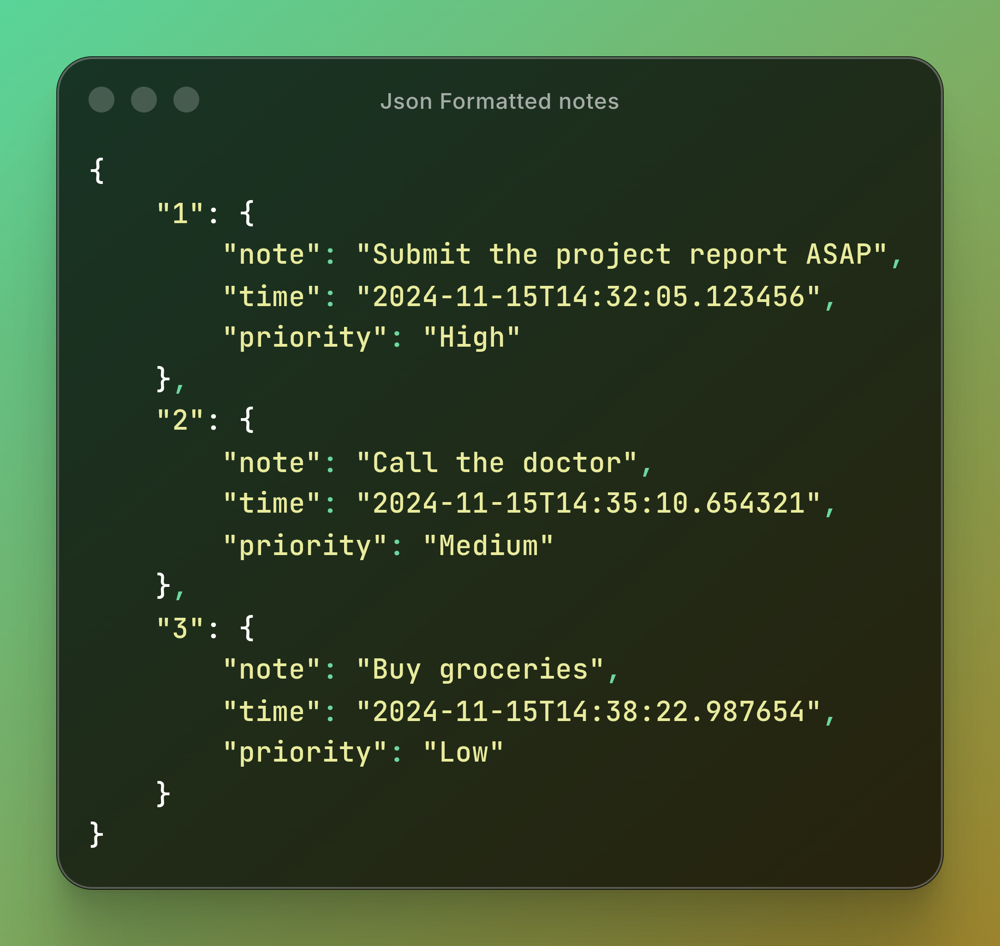

# 📝 NoterLog

> **A lightweight, terminal-based note-taking app built with Python — organize your thoughts with priority-driven sorting and persistent JSON storage.**

---

## 📋 Table of Contents

- [Overview](#-overview)
- [Features](#-features)
- [Project Structure](#-project-structure)
- [Getting Started](#-getting-started)
  - [Prerequisites](#prerequisites)
  - [Installation](#installation)
  - [Running the App](#running-the-app)
- [Usage](#-usage)
- [Priority System](#-priority-system)
- [How It Works](#-how-it-works)
- [File Storage](#-file-storage)
- [Contributing](#-contributing)
- [License](#-license)

---

## 🌟 Overview

**NoterLog** is a simple yet structured command-line note manager. It lets you log notes on the fly, assign priority levels, and automatically sorts them so your most critical thoughts always stay at the top. All notes are persisted locally in a `Notes.json` file — no database, no cloud, no fuss.

---



## ✨ Features

| Feature | Description |
|---|---|
| 📌 **Priority Sorting** | Notes are automatically sorted by priority (High → Medium → Low) |
| 🕐 **Timestamps** | Every note is saved with an exact datetime stamp |
| 💾 **JSON Persistence** | Notes survive between sessions via local `Notes.json` storage |
| 🧹 **Bulk Delete** | Wipe all notes in one prompt when you need a fresh start |
| 🖥️ **Terminal UI** | Clean, centered welcome banners that adapt to your terminal width |
| 🔁 **Continuous Session** | Keep adding notes in a loop until you decide to stop |

---

## 🗂️ Project Structure

```
NoterLog/
│
├── main.py            # Entry point — runs the main loop and handles user interaction
├── functions.py       # Core logic — Note class, file I/O, sorting, priority mapping
├── decoration.py      # UI helpers — terminal banners and welcome messages
└── Notes.json         # Auto-generated persistent storage for all notes
```

### Module Responsibilities

**`main.py`**
Orchestrates the entire user flow: greeting, note input, priority selection, save, delete prompt, and continue/stop decision.

**`functions.py`**
Contains the `Note` class and all business logic — reading/writing JSON, generating timestamps, mapping priority integers to labels, and sorting notes before saving.

**`decoration.py`**
Handles the visual layer — prints centered welcome banners that dynamically adapt to the current terminal width using `shutil.get_terminal_size()`.

**`Notes.json`**
Auto-created on first run if it doesn't exist. Acts as the flat-file database for all stored notes.

---

## 🚀 Getting Started

### Prerequisites

- Python **3.7+** (no third-party dependencies — uses standard library only)

### Installation

```bash
# Clone the repository
git clone https://github.com/Tridib-dev/noter-log.git

# Navigate into the project directory
cd noter-log
```

### Running the App

```bash
python main.py
```

That's it. No `pip install` needed.

---

## 🖥️ Usage

Once launched, the app guides you through a simple interactive session:

```
<=: WELCOME TO NOTER LOG :=>
____________________________

Enter your name : Alex

<=: Welcome Alex to the NOTES world :=>
________________________________________

Enter your note : Buy groceries before 6pm
Note priority (1 => High | 2 => Medium | 3 => Low) : 2

Enter [y => delete all notes] or [n => keep all notes] : n

All notes kept successfully.

Enter [y => continue] or [n => stop] : n

Note taking stopped successfully.
```

---

## 🎯 Priority System

Notes are ranked and sorted automatically before being saved:

| Input | Label | Sort Order |
|---|---|---|
| `1` | 🔴 High | Saved first (top of file) |
| `2` | 🟡 Medium | Saved second |
| `3` | 🟢 Low | Saved last (bottom of file) |

Even if you add a Low priority note before a High priority one, the file will always reflect the correct priority ordering — automatically.

---

## ⚙️ How It Works

```
User Input
    │
    ├─► Validate note (non-empty check)
    ├─► Capture timestamp via datetime.datetime.now()
    ├─► Validate & map priority integer → label (High / Medium / Low)
    ├─► Create Note object
    ├─► Load existing Notes.json
    ├─► Assign new incremental ID
    ├─► Sort all notes by priority
    └─► Write back to Notes.json
```

The `note_save()` method always re-sorts the entire dataset before writing, ensuring the JSON file is always in priority order regardless of insertion sequence.

---

## 📁 File Storage

Notes are stored in `Notes.json` in the same directory as the script. Each note entry looks like this:

```json
{
    "1": {
        "note": "Buy groceries before 6pm",
        "time": "2024-11-15T14:32:05.123456",
        "priority": "Medium"
    },
    "2": {
        "note": "Submit project report",
        "time": "2024-11-15T14:35:10.654321",
        "priority": "High"
    }
}
```


> **Note:** IDs are assigned incrementally and are not re-ordered after sorting — only the key order within the JSON object reflects priority.

---

## 🤝 Contributing

Contributions, ideas, and improvements are welcome!

1. Fork the repository
2. Create a feature branch: `git checkout -b feature/your-feature`
3. Commit your changes: `git commit -m "Add your feature"`
4. Push to the branch: `git push origin feature/your-feature`
5. Open a Pull Request

---

## 📄 License

This project is open source and available under the [MIT License](LICENSE).

---

<div align="center">

Author : Tridib Dey
Made with ❤️ and Python · NoterLog

</div>
